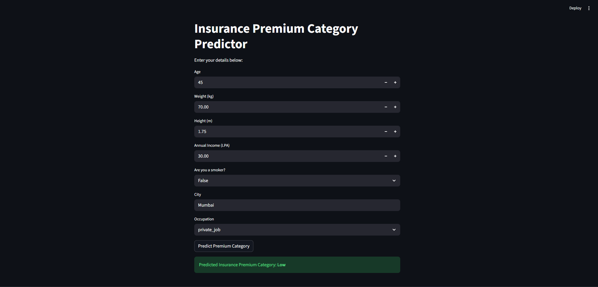

# FastAPI Patient Management System

A comprehensive project illustrating the core concepts of FastAPI, ranging from basic GET requests to advanced data validation using Pydantic, computed fields, and local data persistence.

## 📁 Project Structure

The core logic of the project is contained within the `Patients_Form_Project` directory:

- **`final_api_with_update_delete.py`**: The latest implementation of the Patient API. It features:
  - **Full CRUD Support**: Create, Read, Update, and Delete patients.
  - **Pydantic Models**: Robust data validation and serialization.
  - **Partial Updates**: Uses a separate `PatientUpdate` model for flexible `PUT` operations.
  - **Request Body Handling**: Efficiently processing incoming patient data.
  - **Computed Fields**: Automatic calculation of `BMI` and health `verdict` based on patient metrics.
  - **Validation**: Strict checks using `Annotated`, `Field`, and `Literal`.
  - **Data Persistence**: Local JSON storage for records.
  - **Dynamic Sorting**: Endpoint to sort patient data by specific fields like height, weight, or BMI.
- **`program_reqbody_incl.py`**: An advanced implementation focusing on creation and retrieval.
- **`patient_proj.py`**: A foundational version of the API focusing on path/query parameters and data retrieval.
- **`patients.json`**: Acts as a lightweight local database for storing patient records.

## 🚀 Key Features

- **Robust Data Validation**: Leveraging Pydantic to ensure all incoming data meets specific criteria (e.g., positive heights/weights, specific gender literals).
- **Computed Metrics**: No need to manually provide BMI; the API calculates it dynamically using properties and `@computed_field`.
- **Flexible Data Retrieval**: View all patients, search by ID, or sort the entire list based on physical metrics.
- **Update & Delete**: Easily modify existing records or remove them entirely from the system.
- **Persistent Storage**: Data is saved to and loaded from a local JSON file, allowing it to survive server restarts.

## 🛠️ Installation & Setup

If you are forking or cloning this project, follow these steps to get it running locally.

### 1. Prerequisites
Ensure you have **Python 3.12** or higher installed.

### 2. Install Dependencies
The project uses `fastapi`, `pydantic`, and `uvicorn`. You can install them using pip:

```bash
pip install "fastapi>=0.128.0" "pydantic[email]>=2.12.5" "uvicorn>=0.40.0"
```

*Note: These requirements are derived from the `pyproject.toml` configuration.*

### 3. Running the API
Navigate to the project directory and run the main application using Uvicorn:

```bash
uvicorn Patients_Form_Project.final_api_with_update_delete:app --reload
```

Once the server is running, you can access the interactive documentation at:
- Swagger UI: [http://127.0.0.1:8000/docs](http://127.0.0.1:8000/docs)
- Redoc: [http://127.0.0.1:8000/redoc](http://127.0.0.1:8000/redoc)

## 📡 API Endpoints Summary

| Method | Endpoint | Description |
| :--- | :--- | :--- |
| **GET** | `/` | System health check/welcome message. |
| **GET** | `/about` | Information about the Patient Management System. |
| **GET** | `/view` | Retrieve a list of all registered patients. |
| **GET** | `/patient/{id}` | Get detailed information for a specific patient. |
| **GET** | `/sort` | Sort patients by `height`, `weight`, or `bmi`. |
| **POST** | `/create` | Register a new patient in the database. |
| **PUT** | `/edit/{id}` | Update existing patient details (partial updates supported). |
| **DELETE** | `/delete/{id}` | Remove a patient from the database. |

---

# 🤖 Machine Learning Model Serving with FastAPI & Streamlit

This module demonstrates how to serve a trained Machine Learning model using a FastAPI backend and a user-friendly Streamlit frontend. It specifically focuses on predicting **Insurance Premium Categories** based on user demographics and lifestyle data.



## 📁 Project Structure (ML Serving)

The components are located in the `Serving_MLModels_with_FastAPI` directory:

- **`main.py`**: The FastAPI backend script. It loads the pickled ML model and provides a prediction endpoint.
- **`frontend.py`**: The Streamlit interface that allows users to input their data and receive predictions in real-time.
- **`model.pkl`**: The pre-trained scikit-learn model (v1.6.1).
- **`fastapi_ml_model.ipynb`**: The Jupyter Notebook used for data exploration, preprocessing, and model training.
- **`insurance.csv`**: The dataset used for training the model.

## 🛠️ Detailed Walkthrough

### 1. The FastAPI Backend (`main.py`)
The backend is responsible for the heavy lifting:
- **Model Loading**: Uses `pickle` to load the trained model into memory at startup.
- **Data Validation**: Uses Pydantic's `BaseModel` to ensure incoming data is formatted correctly.
- **Feature Engineering**: Calculates additional features like `BMI`, `City Tier`, `Age Group`, and `Lifestyle Risk` on-the-fly using `@computed_field`.
- **Prediction**: Converts validated data into a Pandas DataFrame and passes it to the model to get the premium category.

### 2. The Streamlit Frontend (`frontend.py`)
Streamlit provides a sleek UI for user interaction:
- **Input Widgets**: Uses `st.number_input`, `st.selectbox`, and `st.text_input` for intuitive data entry.
- **API Communication**: Uses the `requests` library to send a POST request to the FastAPI `/predict` endpoint.
- **Result Display**: Shows the predicted category (Low, Medium, or High) in a success banner if the API call is successful.

### 3. Model Compatibility
- **Scikit-Learn Versioning**: This project specifically uses `scikit-learn==1.6.1` to maintain compatibility with the pickled model file, avoiding common serialization errors.

## 🚀 How to Run

To run this specific module, follow these steps:

### 1. Install ML Dependencies
```bash
pip install pandas scikit-learn==1.6.1 streamlit requests
```

### 2. Start the FastAPI Server
Open a terminal and run:
```bash
uvicorn Serving_MLModels_with_FastAPI.main:app --reload
```

### 3. Start the Streamlit App
Open a **new** terminal and run:
```bash
streamlit run Serving_MLModels_with_FastAPI.frontend.py
```

Now, navigate to the URL provided by Streamlit (usually `http://localhost:8501`) to interact with the Insurance Premium Predictor!

